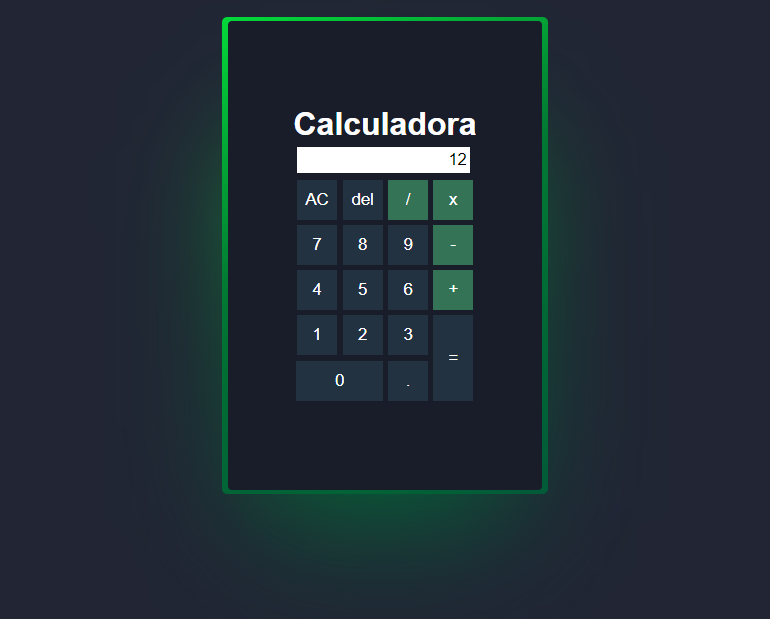

# Calculadora com Bordas Giratorias

Projeto desenvolvido para treinar funcões em java script e animações em CSS.

[Clique aqui para acessar](https://rafael-damasceno.github.io/Calculadora/)

## Tecnologias
- HTML
- CSS
- JavaScript